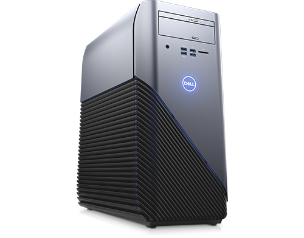
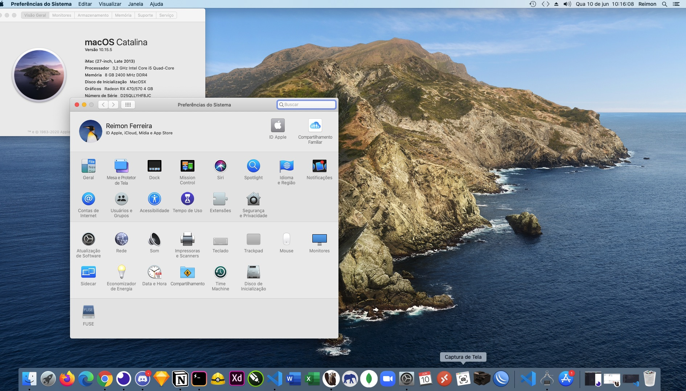

  

# Dell Inspiron 5675

	

## System configuration

| Model     | iMac (27-inch, Late 2013)                        | Version        | 10.15.5                              |
| :-------- | :----------------------------------------------- | :------------- | :----------------------------------- |
| Processor | AMD Ryzen(TM) 5 1400(4C/8T, 10MB Cache, 3.4 GHz) | Graphics       | AMD Radeo (TM) RX 570 with 4GB GDDR5 |
| Memory    | 2400MHz DDR4 1x8GB                               | OS Disk        | KINGSTON SUV400S37240G               |
| Audio     | Realtek ALC899                                   | WiFi/Bluetooth | Qualcomm Wireless QCA61x4A 2x2       |
| Network   | Realtek RTL8168H/8111H                           | Chipset        | X370 Series                          |

## About build

#### Performance

- [Geekbench 5](https://browser.geekbench.com/v5/cpu/2476798):
  - 742 SingleCore
  - 2492 MultiCore
  - [25585 OpenCL Score](https://browser.geekbench.com/v5/compute/1047883)

#### Not Working

- Qualcomm Wireless QCA61x4A 2x2

#### Catalina 10.15.5

- [EFI_OPENCORE](https://github.com/reimon/EFI-CLOVER-RYZER/tree/master/EFI_OPENCORE)

#### Catalina 10.15

- [EFI_CLOVER](https://github.com/reimon/EFI-CLOVER-RYZER/tree/master/EFI_CLOVER)
